# Practica 2.2 Ngiinx. Autenticación.
    Requisitos ; La práctica anterior debe estar funcionando correctamente. Con la redirección HTTPS funcionando. 
## Introducción. 
Hablando de HTTP, la autenticación de acceso básica, esta diseñada para que un usuario tenga unas credenciales y pueda acceder a un navegador web, el programa le pedirá las credenciales cuando realice la solicitud de este.

Para esto, necesitaremos las herramientas openssl para crear las contraseñas.

Primero, comprobaremos que el paquete esté instalado. 

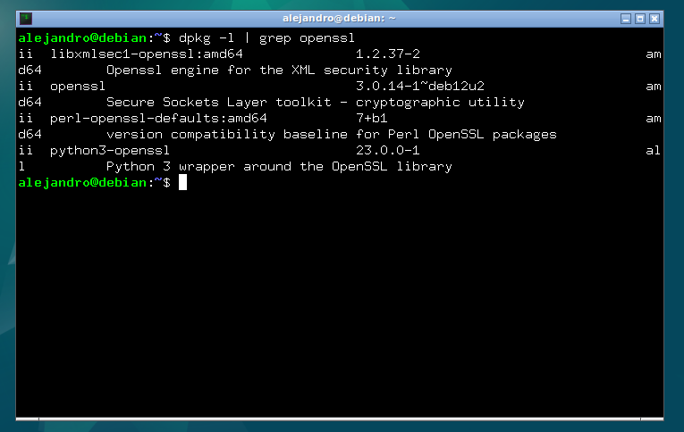

Una vez comprobado, crearemos un archivo oculto, al que llamaremos '.htpasswd' en el directorio de configuracion **/etc/nginx** donde guardar nuestros usuarios y contraseñas. 


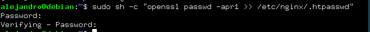

Este proceso, se puede repetir, tantas veces como usuarios quieras crear. Ahora entraremos en el archivo indicado previamente para comprobar la existencia de los usuarios y que se hayan guardado correctamente. 


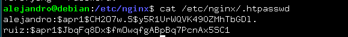


## Configuración del servidor Nginx para autenticación básica. 
Editaremos el archivo que se encuentra en **/etc/nginx/sites-avaliable/tu_nombre** para añadir la restricción de autenticación. 


En el bloque de **location**, protegeremos la raíz, esto se indica con la '**/** ' tras el location para indicar la ruta a la que quieres aplicar el bloque. Lo modificaremos de la siguiente manera: 

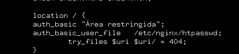

Ahora reiniciaremos para aplicar la configuración que hemos modificado y se muestre nuestra política de acceso. 

Probaremos accediendo a nuestra página web y nos saldrá el siguiente mensaje : 

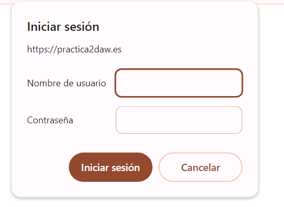

En el caso de que cancelemos la autenticación nos denegará el acceso a la página web, diciendo que es necesario autenticarse. 


Como tarea, hemos iniciado sesión con un usuario válido y con otro inválido. Estos logs lo podremos comprobar en la siguiente imagen, para tener constancia de quien hace peticiones a la página web y cuales son exitosas y cuales no. 

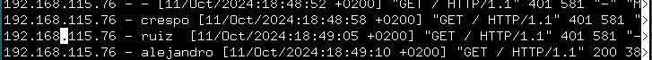

Al final de la foto, podremos ver un código **401** que nos indicará error en la petición debido al fallo en la  autenticación. 

Esto lo haríamos en caso de querer aplicar la autenticación a toda la página web, ahora lo modificaremos para que afecte solo a un archivo en concreto. En mi caso a index2.html. Al cual accederemos mediante autenticación. El archivo se lo indicaremos mediante su ruta despues de la palabra location y previo a la apertura de llaves. 

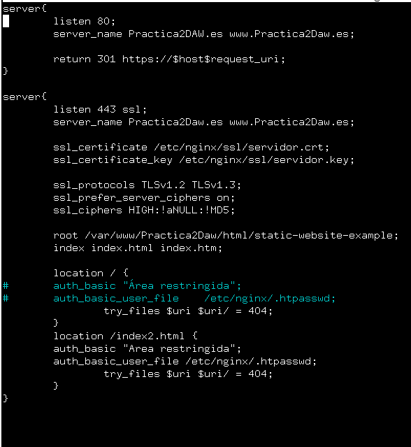

## Combinación de la autenticación básica con la restricción de acceso por IP. 
Para más seguridad y mas filtros, junto a la autenticación se puede implementar una restricción de IP, permitiendo o denegando el acceso de estas. Se puede hacer de forma independiente de la autenticación. 

### Tarea 1.
Configura nginx para que no deje acceder con la IP de la máquina anfitriona al directorio raíz a tu web. Modifica su server block o archivo de configuración y comprueba que niega el acceso. 

Cambiamos el bloque, denegando servicio a las IPs que se muestran en la captura, que en cada caso se personalizarán con las vuestras.

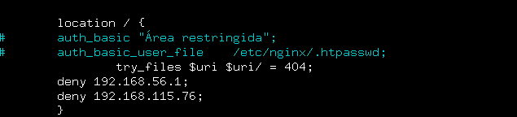

Tras intentar acceder da error: 

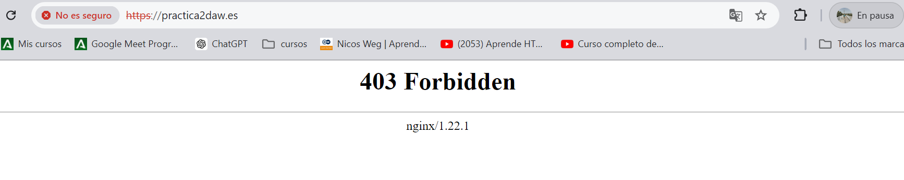

### Tarea 2. 
Configura Nginx para que desde tu máquina anfitriona se tenga que tener tanto una IP válida como un usuario válido, ambas cosas a la vez, y comprueba si puede acceder sin problemas. 

Cambiaremos el bloque del servidor, permitiendo acceso a la IP de nuestra máquina y pidiendo la autenticación de usuarios.

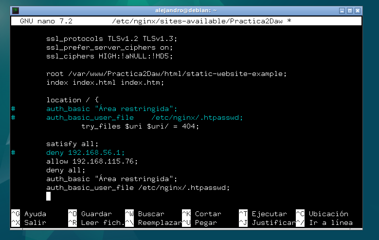

Tras iniciar sesión desde mi máquina : 

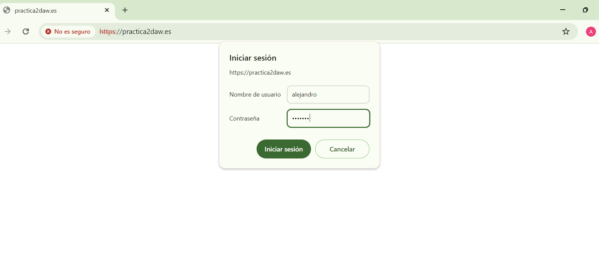


Nos da acceso a la página web, demostrando que tenemos tanto un usuario válido como una IP válida. 

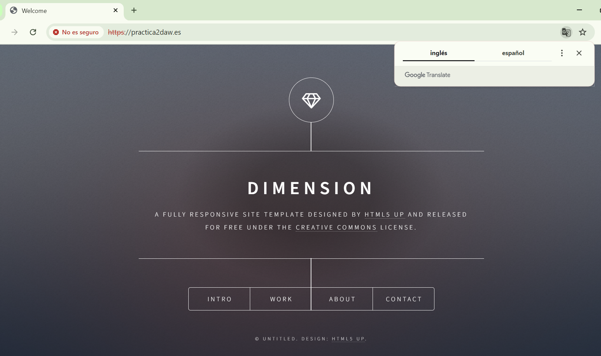

## Cuestiones Finales. 
### Cuestion 1 
Supongamos que yo soy cliente con la IP 172.1.10.15 e intento acceder al directorio web_muy_guay de mi sitio web, equivocándome al poner el usuario y contraseña. ¿Podré acceder?¿Por qué?

```
    location /web_muy_guay {
    #...
    satisfy all;    
    deny  172.1.10.6;
    allow 172.1.10.15;
    allow 172.1.3.14;
    deny  all;
    auth_basic "Cuestión final 1";
    auth_basic_user_file conf/htpasswd;
}
```
No podrás acceder, ya que al tener puesto **satisfy all** tendrás que pasar tanto el filtro de IP válida como el de autenticación de usuario. Al fallar en este último te denegará el acceso. 


### Cuestion 2
Supongamos que yo soy el cliente con la IP 172.1.10.15 e intento acceder al directorio web_muy_guay de mi sitio web, introduciendo correctamente usuari y contraseña. ¿Podré acceder?¿Por qué?

```
        location /web_muy_guay {
    #...
    satisfy all;    
    deny  all;
    deny  172.1.10.6;
    allow 172.1.10.15;
    allow 172.1.3.14;

    auth_basic "Cuestión final 2: The revenge";
    auth_basic_user_file conf/htpasswd;
        }
```
No podrás acceder, ya que al ser **deny all** lo primero que se evalua, te denegará el acceso, la solución sería ponerlo al final, y poner las instrucciones más específicas al principio. 


### Cuestion 3
Supongamos que yo soy el cliente con la IP 172.1.10.15 e intento acceder al directorio web_muy_guay de mi sitio web, introduciendo correctamente usuario y contraseña. ¿Podré acceder?¿Por qué?

```
    location /web_muy_guay {
    #...
    satisfy any;    
    deny  172.1.10.6;
    deny 172.1.10.15;
    allow 172.1.3.14;

    auth_basic "Cuestión final 3: The final combat";
    auth_basic_user_file conf/htpasswd;
}
```
En este caso podrás acceder, ya que la IP está permitida y has puesto correctamente las credenciales de usuario. 

### Cuestion 4
A lo mejor no sabéis que tengo una web para documentar todas mis excursiones espaciales con Jeff, es esta: Jeff Bezos y yo

Supongamos que quiero restringir el acceso al directorio de proyectos porque es muy secreto, eso quiere decir añadir autenticación básica a la URL:Proyectos

Completa la configuración para conseguirlo:

```
    server {
        listen 80;
        listen [::]:80;
        root /var/www/freewebsitetemplates.com/preview/space-science;
        index index.html index.htm index.nginx-debian.html;
        server_name freewebsitetemplates.com www.freewebsitetemplates.com;
        location /projects.html{
            auth_basic "Autenticación Proyectos";
            auth_basic_user_file conf/htpasswd;

            try_files $uri $uri/ =404;
        }
    }
```
En primer lugar pondremos la ruta del archivo tras el location, para que solo se aplique en ese archivo de la página web, después pondremos el código necesario para pedir la autenticación. 
